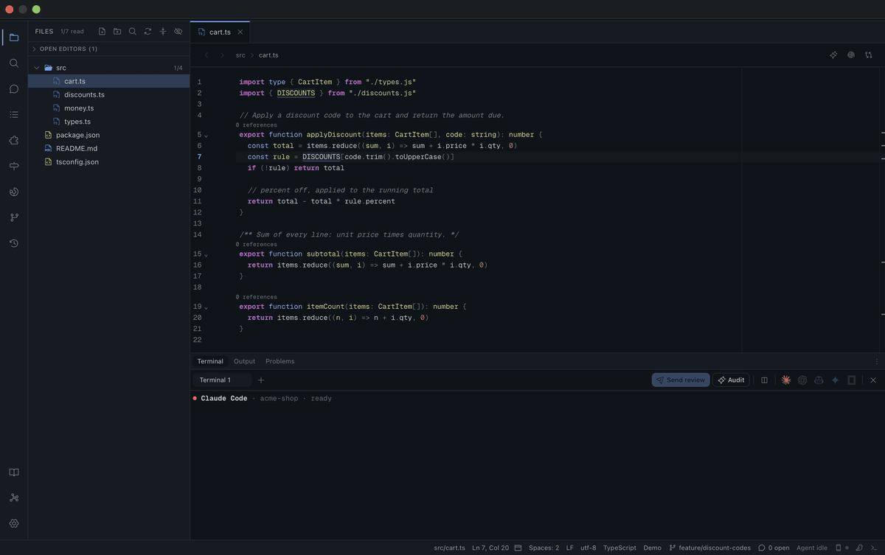
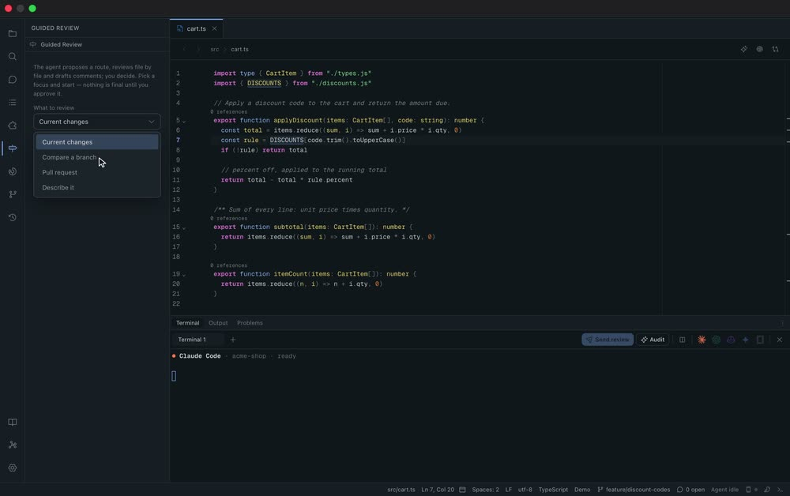
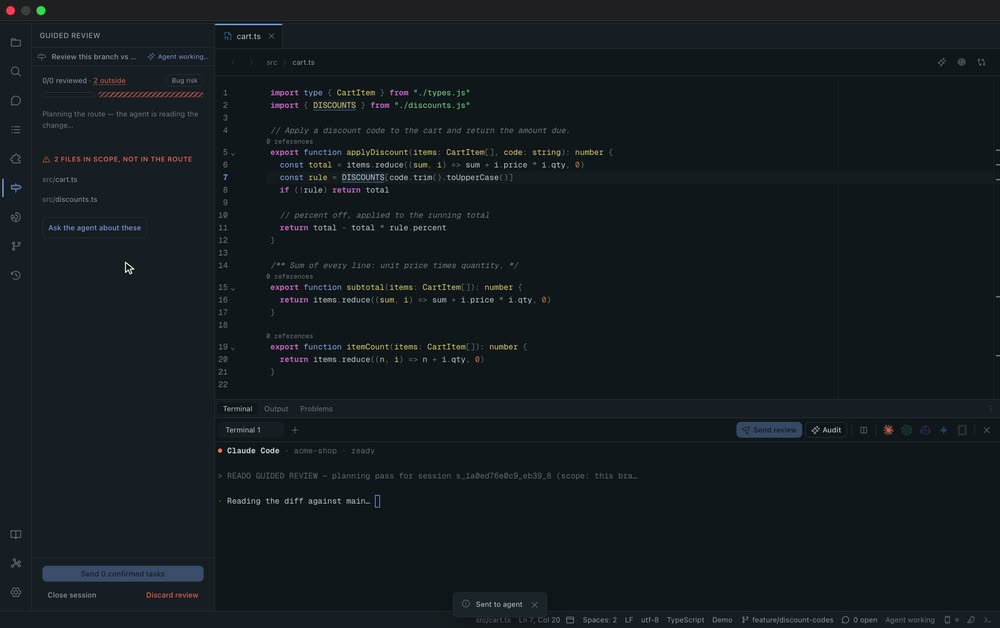
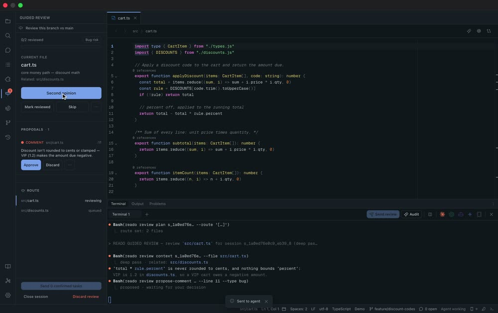
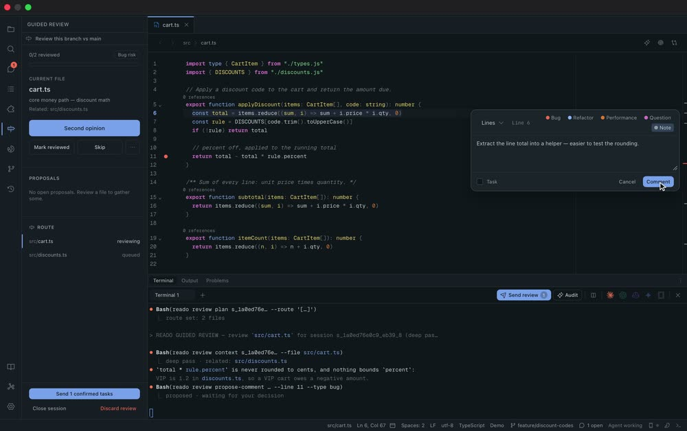
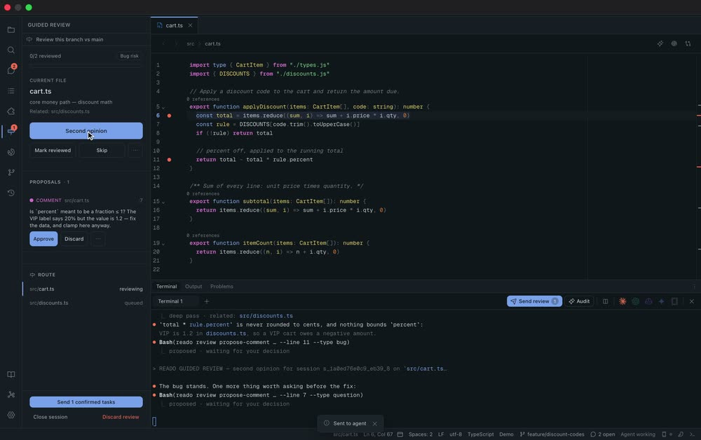
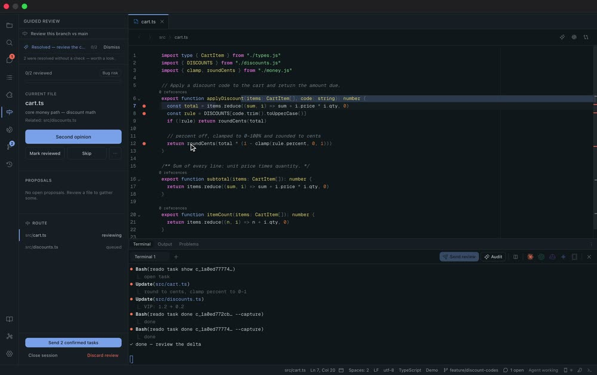

<picture>
  <source media="(prefers-color-scheme: dark)" srcset="docs/media/banner-dark.png">
  
</picture>

<p align="center">
  <a href="https://github.com/WatermelonBros/reado/actions/workflows/ci.yml"></a>
  <a href="https://github.com/WatermelonBros/reado/releases/latest"></a>
  <a href="https://github.com/WatermelonBros/reado/releases"></a>
  
  <a href="LICENSE"></a>
  <a href="https://discord.gg/HHqT9ucXn4"></a>
</p>

<p align="center">
  
  
  
  
</p>

<p align="center">
  <a href="https://github.com/WatermelonBros/reado/releases/latest"><b>Download</b></a> ·
  <a href="https://reado.watermelon-studio.it"><b>Website</b></a> ·
  <a href="https://discord.gg/HHqT9ucXn4"><b>Discord</b></a> ·
  <a href="CONTRIBUTING.md"><b>Contribute</b></a>
</p>

<p align="center"><sub>
  If Reado earns it, a <a href="https://github.com/WatermelonBros/reado/stargazers">star</a> is how a small open-source project gets found.
  The first 50 testers who send feedback get <a href="https://reado.watermelon-studio.it/beta">Reado Pro free for 12 months</a>.
</sub></p>

<p align="center">
  
</p>
<p align="center"><sub>A full guided review on a real branch — unedited, in real time. The agent proposes, you decide, the agent fixes.</sub></p>

## Most IDEs are built for writing code. Reado is built for reading it.

Your agent writes more code than you do now. The job that's left is **reading it
and deciding** — and that deserves a tool of its own. In Reado you read, and you
leave comments anchored to the exact lines that matter; your agent (Claude Code,
Codex, Copilot, Gemini, OpenCode or Cursor) resolves them, and you review what
changed.

> **Inverted code review:** you are the reviewer, the AI is the committer.

## A guided review, with an AI pair

Pick what to review — your working changes, a branch, a pull request — and a
focus: bug risk, security, performance, test coverage. The agent plans a route
through the change, reviews it file by file and **proposes**; nothing is final
until you approve it.

<table>
  <tr>
    <td width="33%" valign="top"><br><sub><b>1 · Point it at your changes.</b> Compare a branch, pick a focus — bug risk, security, performance.</sub></td>
    <td width="33%" valign="top"><br><sub><b>2 · The agent plans a route.</b> It reads the diff in your terminal and orders the files, riskiest first.</sub></td>
    <td width="33%" valign="top"><br><sub><b>3 · It proposes — never final.</b> Findings land on the line as proposals. Nothing touches your code yet.</sub></td>
  </tr>
  <tr>
    <td width="33%" valign="top"><br><sub><b>4 · You review too.</b> Select any line and leave your own comment — Reado is a reading tool first.</sub></td>
    <td width="33%" valign="top"><br><sub><b>5 · Ask for a second opinion.</b> The agent challenges its own pass; you approve what holds up.</sub></td>
    <td width="33%" valign="top"><br><sub><b>6 · Hand it back.</b> Send the approved tasks; the fix lands and the comments resolve.</sub></td>
  </tr>
</table>

## Comments that stay where you left them

A Reado comment is not a sticky note. It is anchored to a line range, typed
(bug, refactor, performance, question, note), threaded, and either a **task** for
the agent or a **note** for the next reader. Comments live next to your code as
plain Markdown in `.reado/`, and they survive edits: when the code moves, they
re-anchor with it — and one whose code is gone becomes an orphan instead of
quietly pointing at the wrong line.

## Your agent does the work — you watch it happen

**Send review** hands your open tasks to the agent running in Reado's terminal.
It works through the `reado` CLI and MCP server — reading your comments, consulting
the project's docs and specs, resolving each task — and Reado reflects every step
live: the reasoning, the files it touches, the task closing. When it's done, a
Δ on the file tree takes you straight to **what changed since you last read it**.

## An IDE that reads like a book

- **Built for reading:** a calm CodeMirror 6 viewer with comfortable line length,
  sticky scope headers, an outline, go-to-definition and code intelligence.
- **Reading coverage:** Reado knows what you have actually read, and what changed
  underneath you since.
- **Project tours:** ship a `tour.json` with your repository and anyone who opens it
  in Reado can walk the code you'd explain to a newcomer, the exact lines lit up and
  explained step by step. The format is [open](docs/tour-format.md) — any tool can
  read and write it.
- **A knowledge base that grows as you read:** the project's docs, specs
  (OpenSpec, Spec Kit) and your notes in one searchable place, plus a graph linking
  comments, files, specs and docs.
- **A browser your agent can drive:** preview your app inside Reado, comment on the
  page itself, and let the agent inspect the DOM, console and network.
- **Reado Anywhere:** pair your phone to follow a review, comment from it, and get
  pinged when the agent is done.
- **Four research-grounded themes** — dark, light, high contrast, sepia — and a UI
  in English, Italian, Spanish, French and German.

## Local-first, open source

Reado is MIT and runs on macOS, Linux and Windows. Your code and your comments
stay on your machine as plain files; an account is optional and never gates the
app.

## Download

Grab the latest signed build from
[**Releases**](https://github.com/WatermelonBros/reado/releases/latest) — macOS
(`.dmg`, signed & notarized), Linux (`.AppImage` / `.deb` / `.rpm`) and Windows
(`.exe` / `.msi`). Reado updates itself from signed releases after that.

## The AI loop

Reado's core loop is **read → annotate → AI-resolve**:

1. You read code and leave comments. Comments flagged as **tasks** are the work
   list; **notes** stay out of the agent's way.
2. Open the terminal (`Cmd/Ctrl+J`), launch **Claude**, **Codex** or **Copilot**,
   then click **Send review**. Reado injects a prompt pointing the agent at your
   open tasks.
3. The agent reads your tasks and comments — from the `reado://tasks` and
   `reado://comments` MCP resources, or `reado task list` — makes the changes,
   and marks each done with `reado task done <id>` (or `reado task fail <id>
   "<reason>"`). Reado's watcher reflects the result live, and resolved comments
   move to history.

The `reado` binary is the stable contract — the on-disk format can evolve without
breaking the agents. It serves both the **MCP server** (`reado mcp`, auto-wired
into each agent's config on project open) and the **CLI** the agent calls, so it
must be on the agent's `PATH` for the AI loop to work. The packaged app bundles
it: install from **Settings → Command-line tool** (links `reado` into
`~/.local/bin`, VS Code style). From a source checkout, build and link it
directly:

```bash
scripts/install-cli.sh           # builds release + links into ~/.local/bin
reado --help
```

Actions (CLI): `reado task list|show|done|fail|link`,
`reado comment add|reply|search`, and `reado kb list|show|search` (to consult
the docs and specs before resolving). Context (MCP): the `reado://tasks`,
`reado://comments`, `reado://reading-progress` and `reado://bookmarks` resources,
plus `browser_*` tools for the in-app preview. Agent identity comes from
`$READO_AGENT` (Reado sets it when launching an agent).

An agent plugin in [`plugin/`](plugin/) teaches Claude Code (and Codex, via
`AGENTS.md`) this contract so the agent resolves tasks correctly. See
[`plugin/README.md`](plugin/README.md) to install it. Other agents (e.g. Copilot)
still get the contract from the **Send review** prompt Reado injects, as long as
the `reado` CLI is installed.

## Keyboard shortcuts

| Shortcut             | Action                   |
| -------------------- | ------------------------ |
| `Cmd/Ctrl + P`       | Go to file (fuzzy)       |
| `Cmd/Ctrl + K`       | Command palette          |
| `Cmd/Ctrl + Shift+F` | Search & replace in project |
| `Cmd/Ctrl + ,`       | Settings                 |

## Contributing

Reado aims to be a friendly open-source project, and contributions are welcome.
Everything you need to build, test and send a change — prerequisites, the dev
loop, the checks CI runs, conventions — is in [CONTRIBUTING.md](CONTRIBUTING.md).
Please read our [Code of Conduct](CODE_OF_CONDUCT.md); security issues go through
[SECURITY.md](SECURITY.md).

## License

[MIT](LICENSE) © Reado contributors
